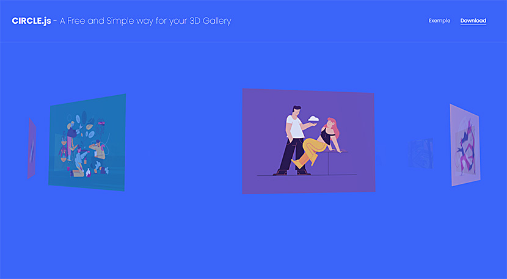

# Circle.js

<p><b><a href="https://circle3dgallery.com/">A Free and Simple way for a 3D Gallery on your website.</a></b><br/>
Transform a simple images list in a 3D gallery. No complex parameter, no javascript modification.<br/>
Circle.js is based on THREE JS.
</p>
<p></p>

## Démo
<a href="https://circle3dgallery.com/exemple.html">Example of a simple 3D gallery</a>

## Features
* Transform picture blocks into 3D gallery
* 100% responsive
* Customizable background color
* No GIF compatibilty
  
## Browser support
Circle.js supports all last generation browsers : Chrome, Firefox, Edge.

## Installation

### CDN
* SCRIPT : https://cdn.jsdelivr.net/gh/getLib/circle.js@main/circle.min.js
* CSS : https://cdn.jsdelivr.net/gh/getLib/circle.js@main/circle.css
### Download from GitHub
You can also directly download Circle.js from GitHub.
### Buy me a coffee
If this plugin is free, you can still support me by offering me a coffee ;)<br/>
<a href="https://www.buymeacoffee.com/circle3djs"></a>

## Create your 3D Gallery

### 1) List your images
First of all create the images list. Create a `div #circle3dImg` and add all your images inside.
You can place this block where you want, it will be hide.
You need to specify the original width `data-width` and original height `data-height` of each image.
```html
<div id="circle3dImg">


</div>
```
### 2) Add your 3D canvas
Then you will place your canvas block `canvas #circle3dCanvas`. Your 3D gallery will be print there.
You can place it where you want in your page.
Change the background-color with the `data-background` parameter.
```html
<canvas id="circle3dCanvas" data-background="#fff"></canvas>
```
Then, define your canvas style. You can do what you want with this block.
For responsive size, you just need to add `!important` after height and width.<br/>
Exemple : 
```css
#circle3dCanvas{height:40vw !important;width:90vw !important;}
```

### 3) Final Touch
Add the Circle .js and .css files at the end of your page.
```html
<link rel="stylesheet" href="circle.css">
<script type="module" src="circle.min.js"></script>
```
<strong>That's it !</strong>

